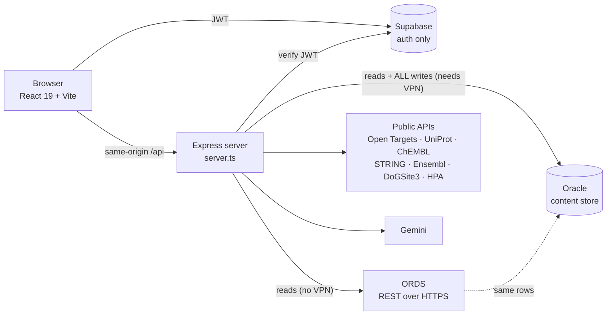

# Disease2Target

**From a disease name to a ranked, evidence-backed list of drug targets — with the reasoning shown.**

Disease2Target aggregates public target-discovery evidence (genetics, expression, dependency, tractability, safety, clinical precedent, literature, network) into a transparent ranking you can interrogate: every score decomposes into the raw numbers behind it, and every number carries its source.


Built by [Nikhil Kurmachalam](mailto:nkurmach@uab.edu) — SPARC, University of Alabama at Birmingham.

---

## Contents

- [Why](#why) · [Features](#features) · [The ranking algorithm](#the-ranking-algorithm) · [Modality Fit](#modality-fit)
- [Architecture](#architecture) · [Quick start](#quick-start) · [Docker](#docker) · [Configuration](#configuration)
- [Data layer](#data-layer-oracle-vs-ords) · [CLI](#cli) · [Benchmarks](#benchmarks) · [Project layout](#project-layout)

---

## Why

Target prioritization usually happens in a spreadsheet that nobody else can audit. A number appears next to a gene and the reasoning lives in someone's head.

Disease2Target makes the whole chain inspectable:

- **Nothing is a black box.** The ranking is a weighted sum over 8 criteria — no ML model, no LLM. Any score can be recomputed by hand from the drill-down.
- **Facts and predictions never share a field.** "This target has 3 approved antibodies" and "this target looks antibody-tractable" are structurally different things and are stored, scored and displayed separately.
- **Novel targets aren't punished for being novel.** Criteria that reward attention (trials, publications) are deliberately down-weighted so a first-in-class target isn't buried by a crowded one.
- **The modality is a lever, not a filter.** Switching from small molecule to siRNA re-weights every criterion and reshuffles the board, because what makes a good target depends on how you intend to drug it.

## Features

| Feature | What it does |
|---|---|
| **Ranking Board** | The weighted 8-criterion board. Per-target report card with a verdict, a per-criterion breakdown down to the raw metric, and stronger alternatives found via protein family + STRING neighbours. Exports a self-contained printable report. |
| **Score Matrix** | Gene × evidence-source coverage matrix — which sources actually have data for which genes. |
| **Evidence dashboard** | Per-gene drill-down: trials, publications, expression, mutations, safety liabilities, pockets. |
| **Funnel** | Hard filters plus a soft composite over registry-driven axes, for narrowing a field to a shortlist. |
| **Modality Fit** | For one target, ranks 12 therapeutic modalities as anchored tiers under a chosen mechanistic goal. Deterministic — see [below](#modality-fit). |
| **Knowledge graph** | Node/edge graph over a snapshot (genes, drugs, trials, pathways). |
| **Co-pilot** | Gemini assistant with the current research state in context. |
| **Exports** | CSV, DOCX, printable HTML reports. |

## The ranking algorithm

Implemented in [`rankingBoard.ts`](rankingBoard.ts). Deliberately "US-News-style": a transparent weighted sum, reproducible by hand.

**1 — Raw signals become 8 criterion scores in `[0,1]`** (`criterionScores()`):

| Criterion | Computation | Source |
|---|---|---|
| Genetics | 60% OT genetic association + 40% somatic mutation frequency | Open Targets · cBioPortal |
| Expression | 50% mRNA \|log2FC\|÷4 + 50% protein \|log2FC\|÷3 | UCSC Xena · CPTAC/LinkedOmics |
| Dependency | `clamp01(−chronos)` | DepMap |
| Tractability | OT tractability score | Open Targets |
| Safety | `LOEUF/1.5 × essentialityPenalty × liabilityPenalty` | gnomAD · OT safety |
| Clinical | 60% max trial phase÷4 + 40% min(trials,10)÷10 | OT trials · ClinicalTrials.gov |
| Literature | publication velocity | Europe PMC |
| Network | WINNER / RWR proximity to disease seed genes | STRING |

Low-confidence expression is discounted ×0.25 (a near-zero normal floor inflates log2FC); pan-essential genes take a ×0.5 safety penalty.

**2 — The modality selects the weight vector:**

| Profile | Genetics | Expression | Dependency | Tractability | Safety | Clinical | Literature | Network |
|---|---|---|---|---|---|---|---|---|
| **Small molecule** | .15 | .12 | .15 | **.20** | .13 | .10 | .05 | .10 |
| Antibody / ADC | .14 | .21 | .09 | .14 | .19 | .12 | .05 | .06 |
| Degrader (PROTAC) | .14 | .17 | .16 | .17 | .13 | .08 | .04 | .11 |
| mRNA / siRNA | .15 | .15 | **.28** | **0** | .20 | .07 | .05 | .10 |
| Gene therapy | **.35** | .08 | .12 | **0** | .25 | .08 | .04 | .08 |

siRNA zeroes tractability (no pocket required) and leans on dependency; gene therapy leans on genetic causality. Weights are exposed as sliders in the UI. **Only the small-molecule profile is enabled** (`ready: true`) — the others are implemented but hidden until they have their own criteria, and small molecule is the only one with a benchmark behind it (ROC-AUC 0.82, see [`benchmark/`](benchmark/)).

**3 — Eligibility gates.** Antibody requires `surface_or_secreted`. A gated target is multiplied by 0.05 *and* sorted below every eligible target — a gate that only penalized wouldn't reliably gate.

**4 — Dead axes are dropped.** A criterion with no data anywhere in the snapshot is removed and the weight budget renormalized over the rest. The Alzheimer's board therefore runs on 7 criteria (no DepMap dependency for a non-cancer disease). Because the axis was absent for the whole field, this doesn't change the ordering — it stops a dead axis wasting budget.

**5 — Rescale so the leader = 100.** Scores are relative *within* a disease and are not comparable across diseases.

On top: `computeVerdict()` assigns a percentile tier and names what a target leads on and what holds it back; `findBetterAlternatives()` surfaces outranking comparables via `target_class` and STRING neighbours. Both are pure functions with no AI.

> **Note:** `get_score` (the Open Targets association score, stored at harvest) is *not* the board score. The board ignores it and recomputes from raw signals.

## Modality Fit

For a single target, ranks 12 modalities across 5 categories as anchored tiers — **Precedented > Plausible > Speculative > Blocked** — under a chosen mechanistic goal (`inhibit`, `degrade`, `reduce_level`, `spare_catalytic`).

The fact/prediction split is the entire design:

- `gatherModalityEvidence()` collects **facts** live from public APIs — Open Targets tractability and developed drugs, DoGSite3 pockets, UniProt (localization, transmembrane, active site, sequence, lysines, ubiquitination), HPA, ChEMBL bioactivity counts, STRING partners, Ensembl exon counts.
- `assessModalities()` sets the tier by **deterministic rules and hard gates**. Reproducible; run-to-run variance is zero. The LLM never touches it.
- The LLM writes **only the one-line rationale**, at temperature 0, restricted to the deterministic basis.

Validated by [`scripts/modalityBenchmark.ts`](scripts/modalityBenchmark.ts) over 20 targets with known clinical outcomes:

| Metric | Result |
|---|---|
| Gate controls | 16/16 |
| Recall of the true modality | **92%** (100% small molecule, 88% non-SM) |
| Logistic-regression baseline | 52% |
| Base-rate ("always small molecule") | 36% |
| Tier calibration (% clinically precedented) | Precedented 74% → Plausible 8% → Speculative 7% → Blocked 0% |
| Must-not-block violations | 0 |

Beating a learned baseline is the point: the rules add value over a model fit to the same features.

Uses **only public APIs**, so it runs without VPN.

## Architecture



The browser never talks to Oracle. `server.ts` chooses its read path at startup: **ORDS over HTTPS** when `USE_ORDS=1`, otherwise **node-oracledb** over SQL\*Net. Writes always take the direct Oracle path.

## Quick start

**Prerequisites:** Node.js 20+ (the server bundle targets node20).

```bash
git clone https://github.com/aimed-lab/DiseaseToGene.git
cd DiseaseToGene
npm install
cp .env.example .env    # then fill it in — see Configuration
npm run dev
```

Open <http://localhost:3000>. `npm run dev` runs the Express API with Vite middleware, so the frontend hot-reloads.

> **`server.ts` does not hot-reload.** Restart the dev server after changing it or `.env`.

> **`.env` must be UTF-8 without a BOM.** A BOM silently corrupts the first variable.

### Scripts

| Command | Purpose |
|---|---|
| `npm run dev` | Dev server (API + Vite middleware) on port 3000 |
| `npm run build` | Build the frontend (Vite) and bundle the server (esbuild) |
| `npm start` | Run the production bundle from `dist-server/` |
| `npm run lint` | `tsc --noEmit` |

## Docker

```bash
cp .env.example .env    # fill in at least the Supabase + ORDS values
docker compose up --build
```

Open <http://localhost:3000>.

The image is a two-stage build: stage 1 compiles with the full toolchain, stage 2 ships only `dist/` and `dist-server/`. The server is bundled by esbuild, so **the runtime image contains no `node_modules` at all** — it is small and has no install step at boot. It runs as a non-root user and exposes a `/api/health` healthcheck.

**The container is a read-only deployment.** Reads go through ORDS over HTTPS, which needs no VPN — so a container can serve the board anywhere. Writes (harvest, save, delete) require the direct Oracle path, and `oracleService.ts` is deliberately excluded from the bundle to keep the native `oracledb` driver out of it. Calling a write endpoint in the container fails with `Cannot find module .../oracleService.ts`.

Run harvests from the CLI or a dev server inside the network. See [`docs/`](docs/) if you need a write-enabled image.

## Configuration

All configuration is environment variables. Copy [`.env.example`](.env.example) and fill it in; `.env` is gitignored.

**Required**

| Variable | Purpose |
|---|---|
| `SUPABASE_URL` · `SUPABASE_ANON_KEY` | Authentication (login, sessions) |
| `SUPABASE_SERVICE_ROLE_KEY` | Server-side JWT verification |
| `GEMINI_API_KEY` | Co-pilot and modality rationales |

**Data layer** — set *one* of these paths:

| Variable | Purpose |
|---|---|
| `USE_ORDS=1` + `ORDS_BASE_URL` | Read over ORDS via HTTPS. **No VPN needed.** Read-only. |
| `ORDS_CLIENT_ID` · `ORDS_CLIENT_SECRET` | Optional OAuth2 for ORDS. Without them, calls are unauthenticated. |
| `USE_ORACLE_STORE=1` + `ORACLE_USER` · `ORACLE_PASSWORD` · `ORACLE_CONNECT_STRING` · `ORACLE_SCHEMA` | Direct Oracle. Required for **all writes**. Needs network access to the DB. |

Both may be set at once — reads then use ORDS and writes use Oracle, which is the recommended local setup.

**Optional**

| Variable | Default | Purpose |
|---|---|---|
| `PORT` | `3000` | Server port |
| `GEMINI_MODEL` | `gemini-2.5-flash` | Model override |
| `NCBI_API_KEY` | — | Raises the PubMed E-Utilities rate allowance |
| `AI_RATE_LIMIT_MAX_REQUESTS` | `20` | AI requests per client per minute |
| `SIGNUP_INVITE_CODE` | — | Gates self-service signup |
| `ALLOWED_ORIGIN` | — | CORS origin allowlist |
| `API_CACHE_TTL_SECONDS` · `DISABLE_API_CACHE` | — | Upstream API response cache |
| `STRING_MIN_SCORE` · `WINNER_SEEDS` · `WINNER_NETWORK_N` · `KG_GENE_N` · `KG_NETWORK_N` | — | Network/KG tuning |
| `USE_DOGSITE3` · `DOGSITE3_BIN` | — | Local DoGSite3 binary instead of the web service |

## Data layer: Oracle vs ORDS

The content store is Oracle, snapshot-centric:

| Table | Role |
|---|---|
| `TARGET_RANKING_SNAPSHOTS` | Parent — one harvest of one disease |
| `RANKING_SCORES` | Per-gene scores for a snapshot |
| `EVIDENCE` | Per-gene evidence rows (~55k for a 6,000-gene snapshot) |
| `AUDIT_LOG` | Append-only |

[`ordsService.ts`](ordsService.ts) mirrors every **read** function of [`oracleService.ts`](oracleService.ts) one-for-one — same signatures, same return shapes — so `server.ts` swaps between them transparently. It is read-only by construction: no write functions exist in it. Large pulls are paginated at 10k rows and fanned out 6 pages at a time.

Supabase is used for **authentication only**; it holds no target data.

**Gotchas.** Oracle JSON columns reject bare `null` (use `{}` or `[]`); timestamps need `SYSTIMESTAMP`; identity columns need `RETURNING INTO`.

## CLI

[`scripts/d2t.ts`](scripts/d2t.ts) runs harvest and enrichment headlessly — useful for long jobs that would time out in a browser.

```bash
npx tsx --env-file=.env scripts/d2t.ts enrich <snapshot_id> all
```

Axes run cheapest-first so a late failure costs the least: `expression`, `proteomics`, `dependency`, `safety`, `tissue`, `mutation`, `annotation`, `druggability`, `clinical`, `patents`, `literature`, `network`.

Other utilities: [`export_snapshot_csv.ts`](scripts/export_snapshot_csv.ts), [`oracle-write-test.ts`](scripts/oracle-write-test.ts), and the `build_*` reference-table builders.

## Benchmarks

```bash
npx tsx --env-file=.env scripts/modalityBenchmark.ts   # modality tiers → deliverables/
npx tsx benchmark/run.ts                               # ranking board: ROC-AUC, ablation, controls
```

[`benchmark/`](benchmark/) holds the board evaluation: ROC-AUC and average precision against a gold set, per-axis ablation (drop an axis, measure what it was worth), and a label-shuffle negative control that must collapse to ~0.5.

## Project layout

```
server.ts                 Express API — routes, auth, read-layer switch
rankingBoard.ts           The ranking engine (criteria, weights, gates, verdict)
modalityFitService.ts     Modality Fit — evidence gathering + deterministic tiers
modalityService.ts        Open Targets developed drugs + tractability
oracleService.ts          Oracle reads + ALL writes (node-oracledb)
ordsService.ts            Oracle reads over ORDS/HTTPS (read-only, no VPN)
dogsiteService.ts         Structures + pocket detection
evidenceProviders.ts      Per-axis evidence fetchers
index.tsx                 App shell and routing
*View.tsx / *Panel.tsx    Feature UIs
scripts/                  CLI, benchmarks, reference-table builders
benchmark/                Ranking evaluation harness
docs/                     Design notes, ORDS setup, handoffs
```

## Data sources

Open Targets · UniProt · ChEMBL · DepMap · gnomAD · cBioPortal · UCSC Xena · CPTAC / LinkedOmics · Human Protein Atlas · STRING · Ensembl · Europe PMC · PubTator3 / PubMed · ClinicalTrials.gov · Enrichr (KEGG / Reactome / WikiPathways) · DoGSite3 (proteins.plus) · AlphaFold / PDBe · Google Gemini

## Maintainer

**Nikhil Kurmachalam** — SPARC, University of Alabama at Birmingham
· [nkurmach@uab.edu](mailto:nkurmach@uab.edu)

Questions about the ranking methodology, the evidence pipeline, or access to a
deployment are best sent by email.

## License

No license file is currently included — all rights reserved by the AIMed Lab, University of Alabama at Birmingham. Contact the maintainer before reuse.
