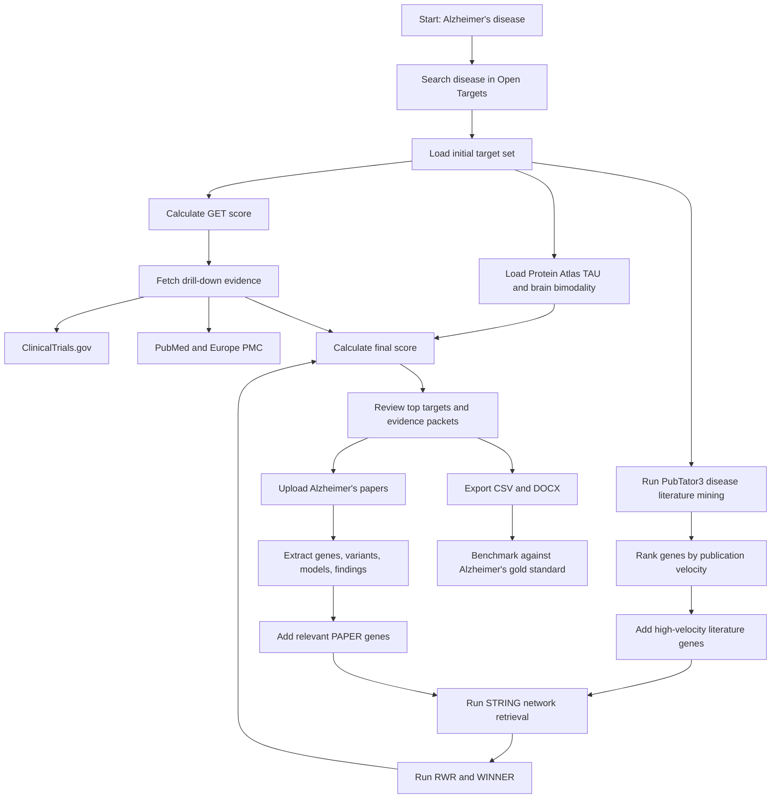
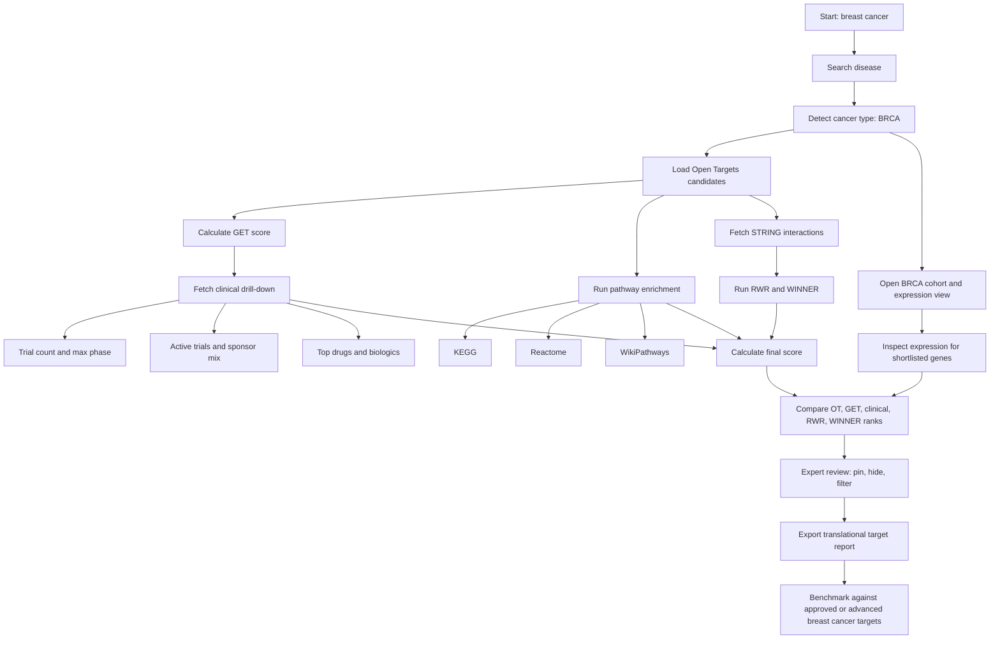
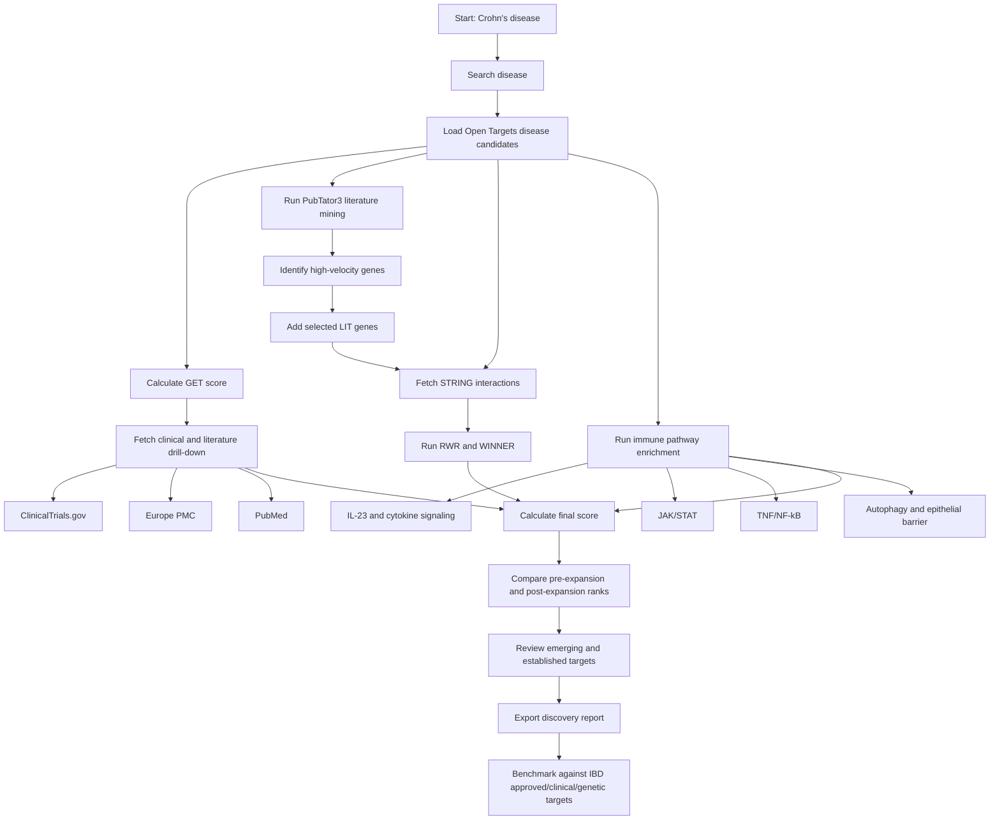

# Disease2Target Case Study Workflows

These workflows convert the three validation case studies into repeatable app runs. Each one is designed to produce an exportable target shortlist plus benchmark-ready ranking data.

## Workflow 1: Alzheimer's Disease Target Triage



### Run Steps

1. Search `Alzheimer's disease`.
2. Load the initial associated targets.
3. Let clinical and literature drill-down populate for top-ranked targets.
4. Open the literature/PubTator view and mine disease-associated gene mentions.
5. Add high-velocity literature genes worth reviewing.
6. Run RWR and WINNER on the expanded gene list.
7. Turn on TAU, max bimodality, brain neurons, and brain non-neurons columns.
8. Upload 3-5 Alzheimer's papers and add extracted genes tagged as `PAPER`.
9. Sort by final score and pin/remove targets during expert review.
10. Export CSV and DOCX.

### Outputs

- Top 25 Alzheimer's target shortlist.
- Evidence packet per target: genetics, expression, tractability, literature velocity, clinical maturity, network score, brain tissue specificity.
- Benchmark file for Recall@10, Recall@25, MRR, and nDCG.

### Gold-Standard Check

Expected established targets include `APOE`, `APP`, `PSEN1`, `PSEN2`, `TREM2`, `BACE1`, `MAPT`, `CLU`, `BIN1`, `ABCA7`, `PICALM`, and `SORL1`.

## Workflow 2: Breast Cancer / BRCA Translational Prioritization



### Run Steps

1. Search `breast cancer` or `breast carcinoma`.
2. Confirm the app enters BRCA cohort context.
3. Load target candidates and calculate GET scores.
4. Fetch clinical evidence for the top 20-30 targets.
5. Review max phase, active trials, trial count, sponsor breakdown, and top interventions.
6. Run pathway enrichment and inspect cancer-relevant terms.
7. Run STRING, RWR, and WINNER scoring.
8. Open cohort/expression view and review expression support for prioritized targets.
9. Compare Open Targets rank versus GET rank versus final score.
10. Export CSV and DOCX.

### Outputs

- Breast cancer target shortlist with translational maturity evidence.
- Pathway enrichment summary across KEGG, Reactome, and WikiPathways.
- Rank comparison table across Open Targets, GET, RWR, WINNER, and final score.
- Benchmark file for Recall@K and nDCG@25 using clinical validation labels.

### Gold-Standard Check

Expected established targets include `ERBB2`, `ESR1`, `PGR`, `BRCA1`, `BRCA2`, `PIK3CA`, `CDK4`, `CDK6`, `EGFR`, `AKT1`, `MTOR`, `VEGFA`, `PDCD1`, `CD274`, and `PARP1`.

## Workflow 3: Crohn's Disease / IBD Emerging Target Discovery



### Run Steps

1. Search `Crohn's disease`.
2. Load initial disease-associated targets.
3. Fetch drill-down evidence for top targets.
4. Run PubTator3 literature mining and rank genes by velocity.
5. Add relevant high-velocity genes as `LIT` targets.
6. Run STRING, RWR, and WINNER on the expanded set.
7. Review pathway enrichment for cytokine, JAK/STAT, TNF/NF-kB, autophagy, and barrier biology.
8. Compare target ranks before and after literature/network expansion.
9. Pin targets with strong genetic, clinical, or emerging-literature support.
10. Export CSV and DOCX.

### Outputs

- Crohn's disease target shortlist with established and emerging candidates.
- Literature velocity table.
- Pre-expansion versus post-expansion rank comparison.
- Pathway evidence report.
- Benchmark file for Recall@10, Recall@25, and rank improvement.

### Gold-Standard Check

Expected established or relevant IBD targets include `TNF`, `IL12B`, `IL23A`, `IL23R`, `JAK1`, `JAK2`, `JAK3`, `TYK2`, `ITGA4`, `ITGB7`, `CCR9`, `NOD2`, `ATG16L1`, `IRGM`, and `STAT3`.

## Shared Benchmark Workflow

```mermaid
flowchart LR
    A[Choose disease panel] --> B[Freeze gold-standard labels]
    B --> C[Run Disease2Target full workflow]
    B --> D[Run baselines]
    D --> D1[Open Targets only]
    D --> D2[GET only]
    D --> D3[GET plus clinical]
    D --> D4[GET plus literature]
    D --> D5[GET plus RWR/WINNER]
    C --> E[Export ranked target table]
    D1 --> F[Compute metrics]
    D2 --> F
    D3 --> F
    D4 --> F
    D5 --> F
    E --> F
    F --> G[Recall@K, MRR, nDCG, evidence completeness]
    G --> H[Decide supported claim]
```

### Shared Metrics

- Recall@10 and Recall@25.
- Precision@10 and Precision@25.
- Mean reciprocal rank.
- nDCG@25.
- Evidence completeness score.
- Rank improvement after adding clinical, literature, RWR, and WINNER features.
- Time from disease query to export-ready report.

### Minimum Deliverables Per Case Study

- One exported CSV.
- One exported DOCX.
- One screenshot of the final ranked target table.
- One screenshot of pathway enrichment.
- One short paragraph interpreting the top 5 targets.
- One benchmark row comparing Disease2Target full score with baseline rankings.
